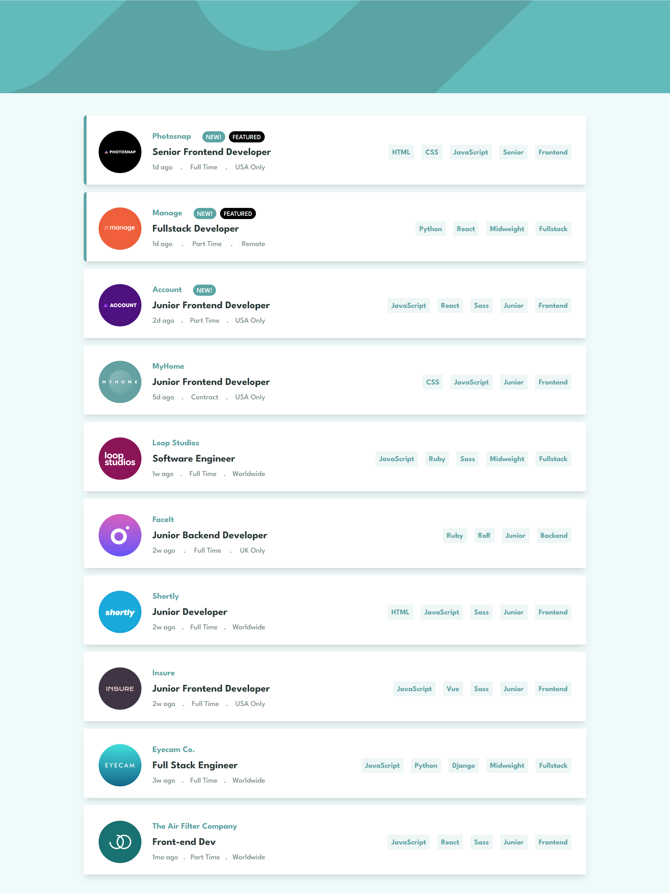
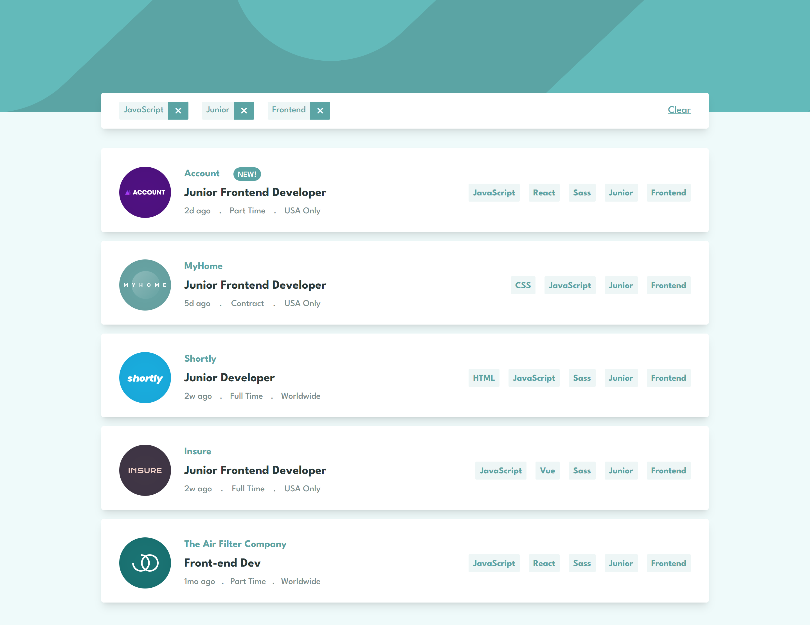
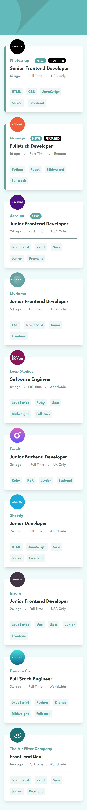
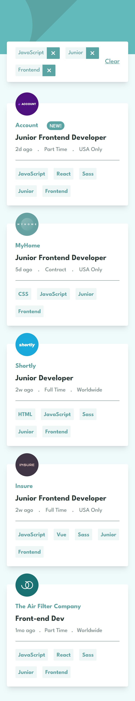

# Frontend Mentor - Job listings with filtering solution
This challenge is to build out job listing page with filter

## Table of contents

- [Overview](#overview)
  - [The challenge](#the-challenge)
  - [Screenshot](#screenshot)
  - [Links](#links)
- [My process](#my-process)
  - [Built with](#built-with)
  - [What I learned](#what-i-learned)
  - [Continued development](#continued-development)
  - [Useful resources](#useful-resources)
- [Author](#author)
- [Acknowledgments](#acknowledgments)

## Overview

### The challenge

Users should be able to:
- Filter job listings based on the categories
- delete item from filtered Categories
- clear all filters

### Links

- Solution URL: [Add solution URL here](https://www.frontendmentor.io/solutions/react-js-tailwindcss-c-yhC_4hJk)
- Live Site URL: [Add live site URL here](https://job-listing-app-with-filter.netlify.app/)

### Built with

- React js
- Tailwind css
- Semantic HTML5 markup
- CSS custom properties
- Flexbox
- CSS Grid
- [React](https://reactjs.org/) - JS library
- [Styled Components](https://tailwindcss.com/) - For styles

## Author

- Frontend Mentor - [@AyaElshaer](https://www.frontendmentor.io/profile/AyaElshaer)

### Screenshot

